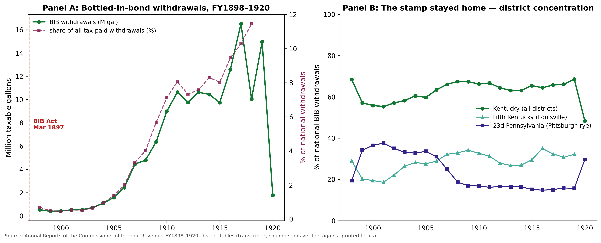
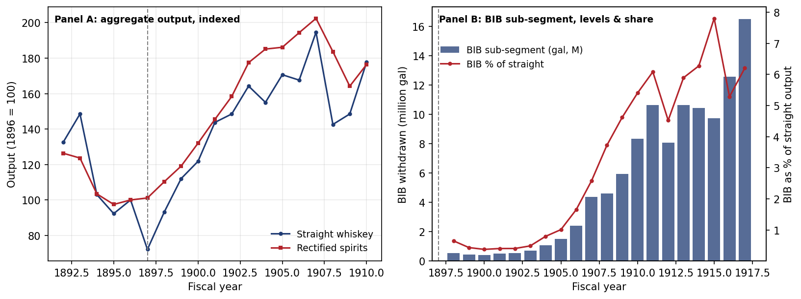
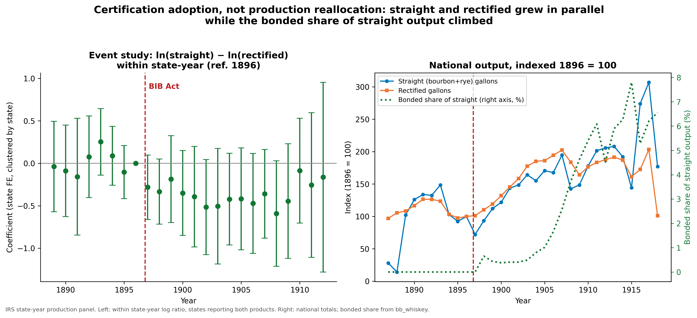

*Job market paper · sole-authored*

## Overview

The Bottled-in-Bond Act of 1897 is usually remembered as one of America's first consumer-protection laws — a federal guarantee, in an age of rampant adulteration, that what the label promised was what the bottle held. This paper reads the Act through public choice instead: as a government-administered solution to a credence-goods problem the straight distillers of Kentucky and Pennsylvania could not solve privately. Their brands and marks were freely counterfeited down a distribution chain they could not police; a Treasury strip stamp, backed by federal criminal law, made their quality signal excludable in a way no private mark ever had.

The reframing yields a sharp, testable distinction. If the Act worked by **raising rivals' costs**, certified output should have grown at the expense of the rectifiers (blenders of cheaper neutral spirit) and a scarcity rent should have opened in relative prices. If it worked by **certifying quality**, a new premium tier should have grown from a near-zero base *without* the rectifying trade falling. The two mechanisms make opposite predictions — and the data can tell them apart.

The evidence comes from a **newly digitized state-by-fiscal-year panel built from the Annual Reports of the Commissioner of Internal Revenue, FY1877–1920** — whiskey deposited into bond, tax-paid withdrawals, spirits rectified, distilleries operated, grain consumed, and (after 1897) withdrawals under the bottled-in-bond stamp — validated against the printed totals through 458 cross-year chain assertions.

## Abstract

> "The Bottled-in-Bond Act of 1897 allowed whiskey to be sold under a federal strip stamp certifying it as the unblended product of a single distillery and season, aged four years in a government-supervised bonded warehouse. Conventionally read as consumer protection, the Act is reinterpreted here, through public choice, as a government-administered credence-goods certification. Using a newly digitized state-by-fiscal-year panel built from the reports of the Commissioner of Internal Revenue, we estimate a common-treatment-date event study and difference-in-differences and find that the Act did not foreclose the rectifier trade: rectified output grew at least as fast as straight whiskey after 1897. Instead it created a distinct certified premium segment that expanded roughly twenty-four percent per year from a near-zero base, with its rents concentrated overwhelmingly among incumbent Kentucky and Pennsylvania producers. Capture operated not by raising rivals' costs but through the geographic distribution of a manufactured premium segment."

## A preview of the findings

**1. No foreclosure.** Indexed to 1896, rectified output reaches **186.1** by 1905 against straight whiskey's **170.6** — the trade the bill's proponents complained of grew *faster*, not slower, after the Act. The within-state difference-in-differences on the straight–rectified gap is near zero, and the rectified series rises rather than falls.

**2. A manufactured premium segment.** The genuine expansion is the certified sub-segment itself: bottled-in-bond withdrawals grew from **0.54 million gallons in FY1898 to 16.51 million in FY1917** — a thirty-one-fold increase — at roughly **24% per year** relative to rectified output. And it is *net-new volume*, not relabeling: within adopting states, bonded gallons did not displace non-bonded straight output (elasticity ≈ **−0.10**, far from the −1 that one-for-one relabeling implies). A hedonic model of hand-collected price quotes attaches a **~9.6% premium** to the bonded label, conditional on age and channel, while the certifiable–rectified price gap does not widen — the price pattern a quality-signaling mechanism predicts and a scarcity-rent mechanism does not.

**3. Geographically captured rents.** Kentucky and Pennsylvania together supplied **92.2% of all bonded withdrawals over 1898–1904**, with the Louisville collection district — home market of the Act's chief proponent, E. H. Taylor Jr. — alone taking nearly a third of the national total. The demand for certified whiskey was actively cultivated by Harvey Wiley's federal purity chemists, whose authority the distillers enrolled to teach buyers to distrust uncertified spirit. The mechanism is credence-segment creation; the distribution is geographic rent capture.

The upshot: **capture need not look like foreclosure.** A regulation can expand a market, resolve a real information asymmetry, and still function as capture through who collects the rents it manufactures.

## Bonded whiskey withdrawals by state, 1898–1920

Hover any line to read the exact figure — the certification was overwhelmingly a Kentucky (and Pennsylvania) phenomenon.

```{ojs}
//| echo: false
bibdata = d3.csvParse(`fy,state,bib_gal
1898,IL,29792
1898,IN,3695
1898,KY,366622
1898,OH,16290
1898,PA,108852
1899,IL,16267
1899,IN,779
1899,KY,228614
1899,OH,3825
1899,PA,140354
1900,IL,16769
1900,IN,1049
1900,KY,234914
1900,OH,7512
1900,PA,156277
1901,IL,21526
1901,IN,6999
1901,KY,288358
1901,OH,5549
1901,PA,198172
1902,IL,29163
1902,IN,5754
1902,KY,305220
1902,OH,6710
1902,PA,188137
1903,IL,38858
1903,IN,5665
1903,KY,418530
1903,OH,16364
1903,PA,238736
1904,IL,44209
1904,IN,6298
1904,KY,657856
1904,OH,19960
1904,PA,356339
1905,IL,50156
1905,IN,10362
1905,KY,949751
1905,OH,29235
1905,PA,538237
1906,IL,63010
1906,IN,12166
1906,KY,1547093
1906,OH,33132
1906,PA,761699
1907,IL,85983
1907,IN,25684
1907,KY,2942260
1907,MO,5712
1907,OH,202842
1907,PA,1122255
1908,IL,95289
1908,IN,49335
1908,KY,3236470
1908,MO,17355
1908,OH,387822
1908,PA,921612
1909,IL,228788
1909,IN,68933
1909,KY,4288326
1909,MO,68972
1909,OH,471965
1909,PA,1114639
1910,IL,368282
1910,IN,88726
1910,KY,5950277
1910,MO,90179
1910,OH,795664
1910,PA,1548983
1911,IL,559046
1911,IN,102312
1911,KY,7095958
1911,MO,104016
1911,OH,756218
1911,PA,1781855
1912,IL,445870
1912,IN,117300
1912,KY,6277845
1912,MO,61851
1912,OH,829740
1912,PA,1686498
1913,IL,621964
1913,IN,149676
1913,KY,6706756
1913,MO,45071
1913,OH,952206
1913,PA,1805902
1914,IL,660226
1914,IN,162442
1914,KY,6593926
1914,MO,30837
1914,OH,966116
1914,PA,1757810
1915,IL,602720
1915,IN,216139
1915,KY,6381863
1915,MO,37780
1915,OH,787935
1915,PA,1499255
1916,IL,811244
1916,IN,361497
1916,KY,8104846
1916,MO,59166
1916,OH,1044003
1916,PA,1910709
1917,IL,942554
1917,IN,320259
1917,KY,10858233
1917,MO,104072
1917,OH,1391836
1917,PA,2582600
1918,IL,630848
1918,IN,182757
1918,KY,6648240
1918,MO,32062
1918,OH,754708
1918,PA,1677916
1919,IL,781131
1919,IN,237899
1919,KY,10274290
1919,MO,30706
1919,OH,1068483
1919,PA,2389728
1920,IL,170234
1920,IN,17001
1920,KY,854520
1920,MO,2796
1920,OH,30155
1920,PA,529473`, d3.autoType)
```

```{ojs}
//| echo: false
Plot.plot({
  marginLeft: 66,
  height: 380,
  x: {label: "Fiscal year", tickFormat: "d"},
  y: {label: "Gallons withdrawn", grid: true, tickFormat: "~s"},
  color: {legend: true},
  marks: [
    Plot.ruleY([0]),
    Plot.line(bibdata, {x: "fy", y: "bib_gal", z: "state", stroke: "state", strokeWidth: 2, curve: "catmull-rom"}),
    Plot.dot(bibdata, Plot.pointer({x: "fy", y: "bib_gal", stroke: "state", r: 4})),
    Plot.tip(bibdata, Plot.pointer({x: "fy", y: "bib_gal", title: (d) => `${d.state} · FY${d.fy}\n${d.bib_gal.toLocaleString()} gallons`}))
  ]
})
```

## Selected figures

{fig-alt="Line chart of national bottled-in-bond withdrawals rising from 0.54 to 16.51 million gallons, 1898–1917, with Kentucky and Pennsylvania supplying most of the volume"}

{fig-alt="Chart comparing the small but fast-growing bonded sub-segment with the much larger straight and rectified output series"}

{fig-alt="Indexed output series showing rectified spirits growing at least as fast as straight whiskey after 1897"}

## Key estimate

**Hedonic price model** (log price per proof gallon; rectified spirits the omitted category; channel, state, and year fixed effects):

| Variable | Coefficient | Std. error |
|---|---:|---:|
| Bottled-in-bond | +0.096* | 0.058 |
| Age (per year) | +0.074*** | 0.009 |

N = 187; R² = 0.66. \*p < 0.10, \*\*\*p < 0.01. Stable across real-price and high-confidence-quote specifications.

---

**JEL codes:** N41 · L51 · D72 · K23

**Keywords:** bottled-in-bond, regulatory capture, credence goods, certification, whiskey

**Suggested citation:** Smith, Jacob R. (2026). "Distillers and Chemists: Strategic Capture of the Bottled-in-Bond Act of 1897." Working paper, Middle Tennessee State University.

::: {.callout-note}
This page is a preview. The full draft — including the common-treatment-date event study, the relabeling test, the legislative and archival record on intent (the committee report, the Aldrich "or owner" amendment, the organized rectifier remonstrances), and the complete robustness battery — is available on request at [jrs2ge@mtmail.mtsu.edu](mailto:jrs2ge@mtmail.mtsu.edu).
:::
