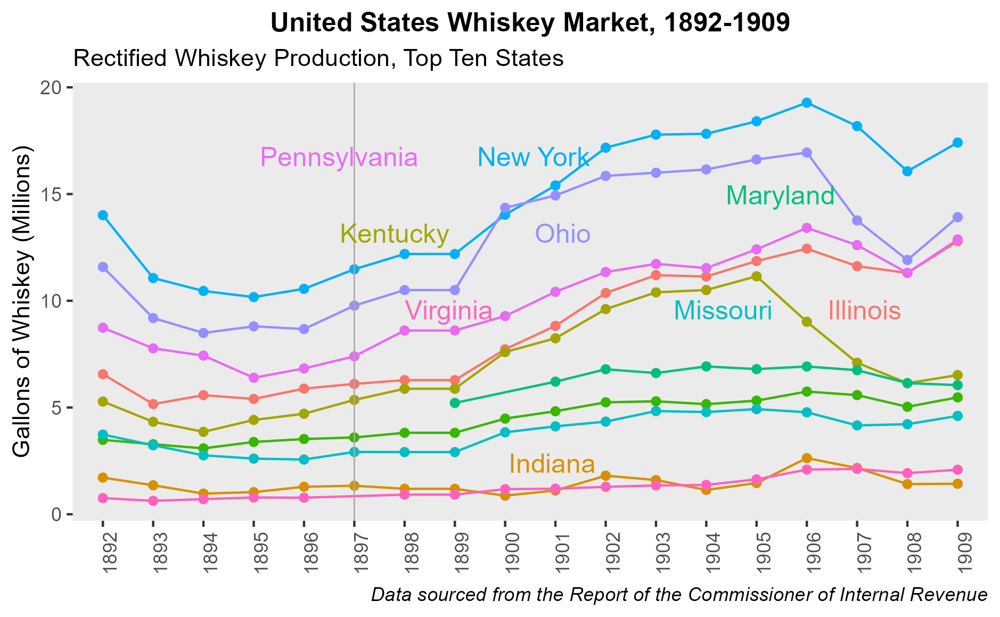
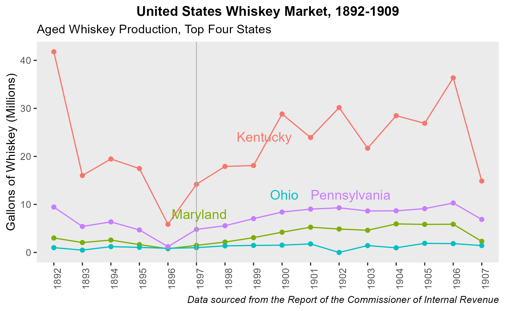
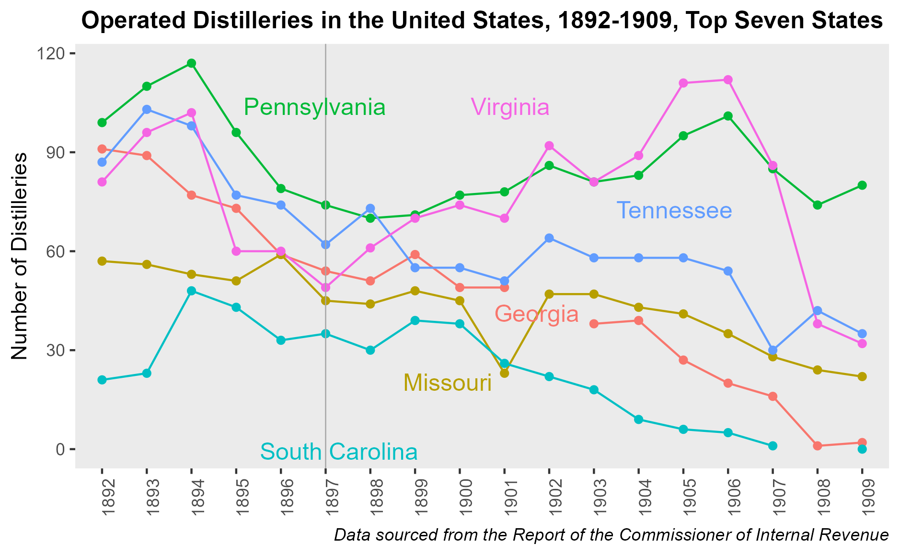
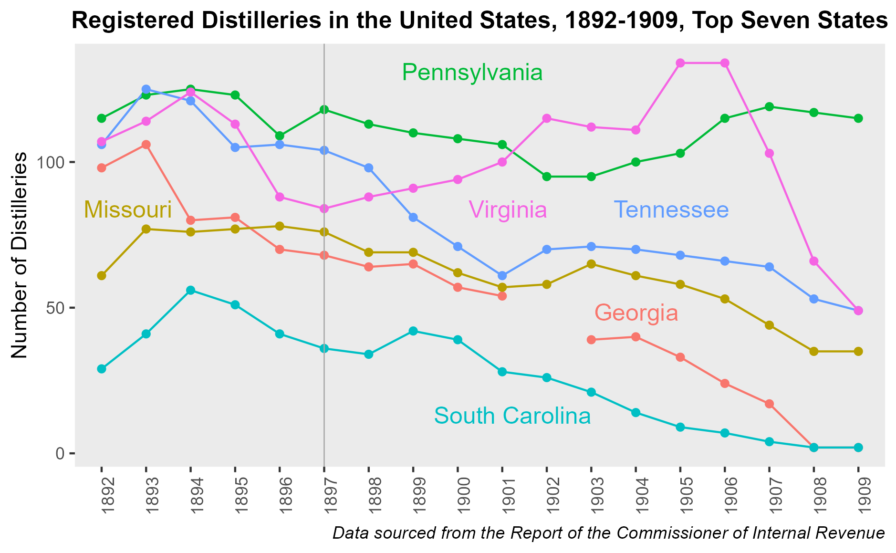
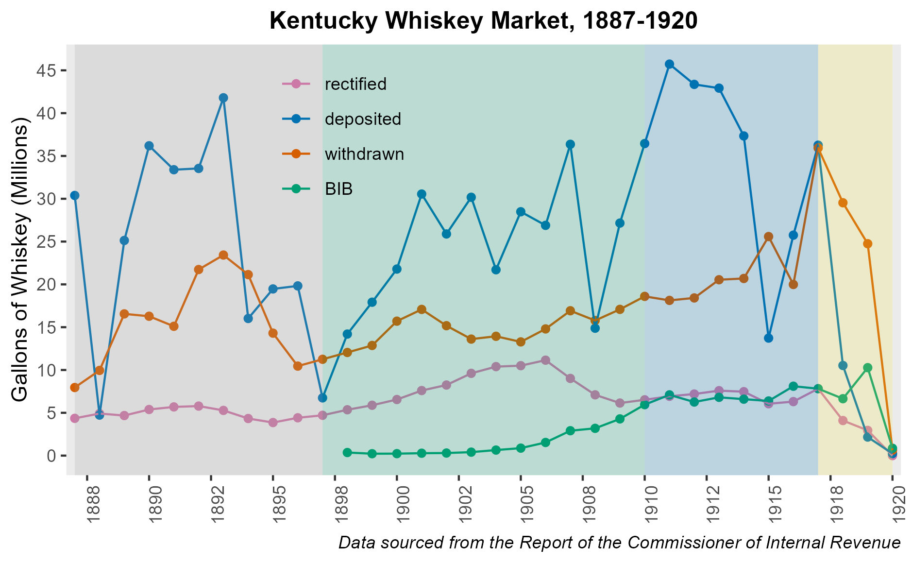
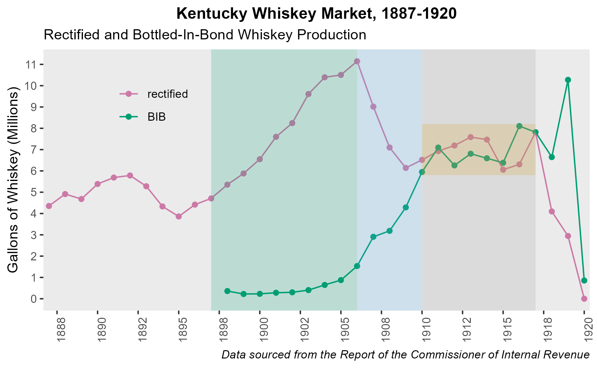
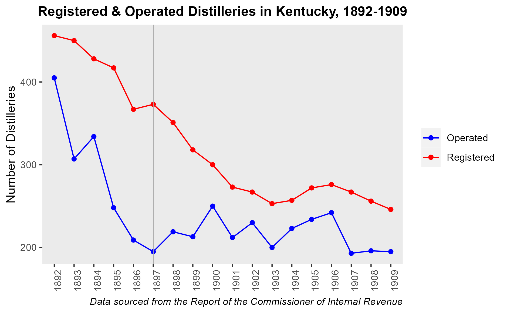

```{r setup, include=FALSE}
knitr::opts_chunk$set(echo = TRUE)
```

## **Progressive Era Whiskey Market Data Collection Project**

[Report of the Commissioner of Internal Revenue.](https://catalog.hathitrust.org/Record/000500840)

### **Panel Data**









### **Kentucky Data**






